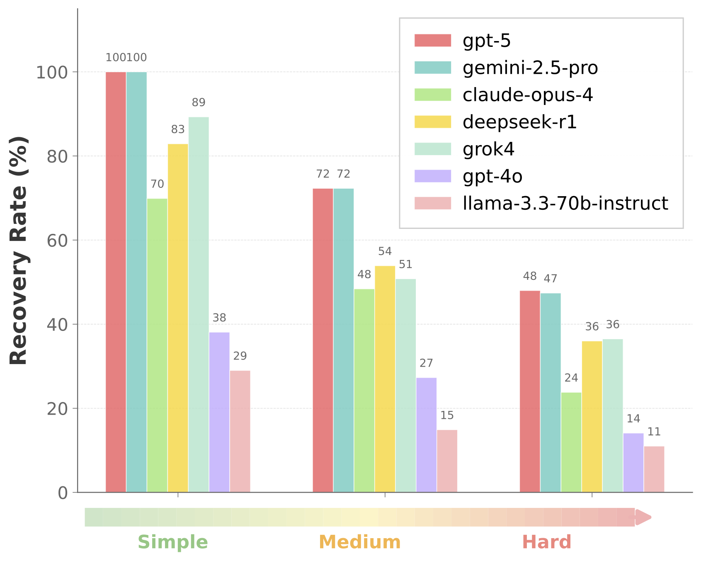
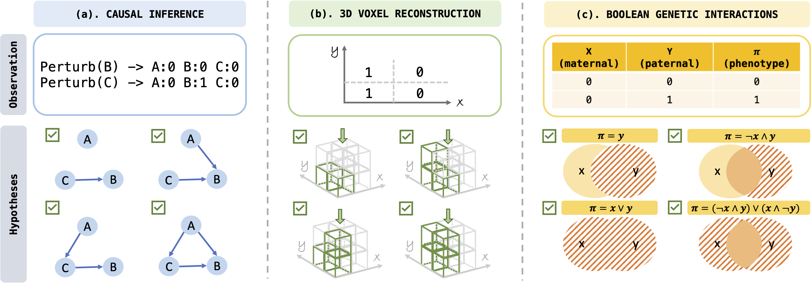

<div align="center">

# 🔬 HypoSpace

### *Evaluating LLM Creativity as Set-Valued Hypothesis Generators under Underdetermination*

[](https://arxiv.org)
[](https://www.python.org)
[](https://opensource.org/licenses/MIT)
[](https://github.com/psf/black)

---

### 🎯 Three Domains • Three Metrics • Infinite Insights

</div>

<p align="center">
  
  &nbsp;&nbsp;&nbsp;
  
</p>

<p align="center">
  
</p>

<div align="center">

### 🧬 Causal Graphs • 📦 3D Reconstruction • 🔀 Boolean Logic

</div>

---

## 📖 About

> **TL;DR**: HypoSpace evaluates how well LLMs generate *diverse sets* of valid hypotheses in underdetermined scientific problems, not just single correct answers.

### The Challenge

As language models are increasingly used in scientific workflows, evaluating their ability to propose **sets of explanations**—not just a single correct answer—becomes critical. Many scientific problems are **underdetermined**: multiple, mechanistically distinct hypotheses are consistent with the same observations.

### Our Solution

We introduce **HypoSpace**, a diagnostic suite that treats LLMs as samplers of finite hypothesis sets and measures three complementary indicators:

| Metric | Symbol | What It Measures |
|--------|--------|------------------|
| **🎯 Validity** | *V* | Precision of proposals consistent with observations |
| **✨ Uniqueness** | *U* | Non-redundancy among proposals |
| **📈 Recovery** | *R* | Coverage of the enumerated admissible set |

### Three Structured Domains

We instantiate HypoSpace in three domains with deterministic validators and exactly enumerated hypothesis spaces:

1. **🧬 Causal Graphs** — from perturbations
2. **📦 3D Voxel Reconstruction** — gravity-constrained from top-down projections  
3. **🔀 Boolean Genetic Interactions** — logical function discovery

### Key Findings

Across instruction-tuned and reasoning-focused models, **Validity** often remains high while **Uniqueness** and **Recovery** degrade as the admissible space grows, revealing **mode collapse** that is invisible to correctness-only metrics.

> 💡 HypoSpace offers a controlled probe—rather than a leaderboard—for methods that explicitly explore and cover admissible explanation spaces.

---

## 📁 Repository Structure

```
📂 HypoSpace/
│
├── 📦 3d/                                  ← 3D Voxel Reconstruction Domain
│   ├── 🔧 generate_3d_dataset_complete.py  • Dataset generator
│   ├── 🚀 run_3d_benchmark.py              • Benchmark runner
│   ├── 📚 modules/                         • LLM interface & models
│   │   ├── llm_interface.py
│   │   └── models.py
│   └── ⚙️  config/
│       └── config_gpt4o.yaml               • Configuration file
│
├── 🔀 boolean/                             ← Boolean Genetic Interactions
│   ├── 🔧 boolean_dataset.py               • Dataset generator
│   ├── 🚀 boolean_benchmark.py             • Benchmark runner
│   ├── 📚 modules/
│   │   ├── llm_interface.py
│   │   └── models.py
│   └── ⚙️  config/
│       └── config_gpt4o.yaml
│
└── 🧬 causal/                              ← Causal Graph Discovery
    ├── 🔧 generate_causal_dataset.py       • Dataset generator (small)
    ├── 🔧 generate_causal_dataset_for_large.py  • Dataset generator (large)
    ├── 🚀 run_causal_benchmark.py          • Benchmark runner
    ├── 📚 modules/
    │   ├── llm_interface.py
    │   └── models.py
    └── ⚙️  config/
        └── config_gpt4o.yaml
```

---

## 🚀 Quick Start

### Step 1️⃣: Configure Your LLM

Edit the YAML config files in each domain's `config/` folder:

**What you can customize:**
- 🤖 LLM provider and model
- 🌡️ Temperature settings
- 📂 Output paths
- 💾 Checkpoint directories

**Example:** `config/config_gpt4o.yaml`

```yaml
llm:
  type: openrouter              # Options: openai, anthropic, openrouter
  models:
    openrouter: "openai/gpt-4o"
  api_keys:
    openrouter: "your-api-key"  # ⚠️ Replace with your actual API key
  temperature: 0.7              # 0.0 = deterministic, 1.0 = creative

benchmark:
  checkpoint: "checkpoints"     # Resume interrupted runs
  verbose: true                 # Print detailed logs
  output_pattern: "results/{dataset_name}_{model}.json"
```

### Step 2️⃣: Generate Datasets

Each domain has its own dataset generator. Here are examples for all three:

<details>
<summary><b>🧬 Causal Graphs</b> (click to expand)</summary>

```bash
cd causal
python generate_causal_dataset.py \
  --nodes 3 \
  --seed 33550336 \
  --output "datasets/node03/n3_all_observations.json"
```

**Parameters:**
- `--nodes`: Number of nodes in graphs (3, 4, 5, etc.)
- `--seed`: Random seed for reproducibility
- `--output`: Path to save dataset JSON

</details>

<details>
<summary><b>📦 3D Voxel Reconstruction</b> (click to expand)</summary>

```bash
cd 3d
python generate_3d_dataset_complete.py \
  --grid-size 3 \
  --max-height 3 \
  --max-blocks 1 \
  --fixed \
  --seed 33550336 \
  --output "datasets/3d_grid3_h3.json"
```

**Parameters:**
- `--grid-size`: Grid dimensions (e.g., 3 for 3×3)
- `--max-height`: Maximum structure height
- `--max-blocks`: Maximum number of blocks in top view
- `--fixed`: If set, generate only structures with exactly max-blocks blocks, else from 1 to max-blocks
- `--output`: Output file path

</details>

<details>
<summary><b>🔀 Boolean Logic</b> (click to expand)</summary>

```bash
cd boolean
python boolean_dataset.py \
  --operators basic \
  --max-depth 2 \
  --output 'datasets/boolean_2var.json' \
  --seed 33550336 \
```

**Parameters:**
- `--operators`: Allowed Boolean operators: choices=['basic', 'extended', 'full']
- `--max-depth`: Maximum expression depth
- `--output`: Output JSON file

</details>

### Step 3️⃣: Run Benchmarks

Run the benchmark for your chosen domain:

<details>
<summary><b>🧬 Causal Benchmark</b></summary>

```bash
cd causal
python run_causal_benchmark.py \
  --dataset "datasets/node03/n3_all_observations.json" \
  --config "config/config_gpt4o.yaml" \
  --n-samples 30 \
  --query-multiplier 1.0 \
  --seed 33550336
```

**Run in background with logging:**
```bash
nohup python -u run_causal_benchmark.py \
  --dataset "datasets/node03/n3_all_observations.json" \
  --config "config/config_gpt4o.yaml" \
  --n-samples 30 \
  --query-multiplier 1.0 \
  --seed 33550336 > logs/causal_gpt4o.log 2>&1 &
```

</details>

<details>
<summary><b>📦 3D Benchmark</b></summary>

```bash
cd 3d
python run_3d_benchmark.py \
  --dataset "datasets/3d_grid3_h3.json" \
  --config "config/config_gpt4o.yaml" \
  --n-samples 30 \
  --query-multiplier 1.0 \
  --seed 33550336
```

</details>

<details>
<summary><b>🔀 Boolean Benchmark</b></summary>

```bash
cd boolean
python boolean_benchmark.py \
  --dataset "datasets/boolean_2var.json" \
  --config "config/config_gpt4o.yaml" \
  --n-samples 30 \
  --query-multiplier 1.0 \
  --seed 33550336
```

</details>

**Common Parameters:**
- `--dataset`: Path to generated dataset
- `--config`: Configuration YAML file
- `--n-samples`: Number of observation sets to evaluate
- `--query-multiplier`: Multiplier for queries per task
- `--seed`: Random seed for reproducibility

### Step 4️⃣: Analyze Results

Results are automatically saved as JSON files in the `results/` directory.

**What's included:**

```json
{
  "metadata": {
    "model": "openai/gpt-4o",
    "dataset": "causal_n3",
    "n_samples": 30,
    "timestamp": "2025-10-17T12:00:00"
  },
  "aggregate_metrics": {
    "mean_validity": 0.92,      // 🎯 How many proposals are valid
    "mean_uniqueness": 0.78,    // ✨ How diverse are the proposals
    "mean_recovery": 0.65,      // 📈 Coverage of solution space
    "std_validity": 0.08,
    "std_uniqueness": 0.12,
    "std_recovery": 0.15
  },
  "results": [/* detailed per-sample results */]
}
```

**Understanding the Metrics:**

| Metric | Range | Good Score | Interpretation |
|--------|-------|------------|----------------|
| 🎯 **Validity** | 0-1 | > 0.90 | Model proposes correct hypotheses |
| ✨ **Uniqueness** | 0-1 | > 0.80 | Model avoids redundant proposals |
| 📈 **Recovery** | 0-1 | > 0.80 | Model explores solution space well |

---

## 📊 Supported Models

| Provider | Example Models | Config Type |
|----------|----------------|-------------|
| **OpenAI** | GPT-4o, GPT-4-turbo, GPT-3.5 | `openai` |
| **OpenRouter** | Any model via OpenRouter | `openrouter` |

---

## 📝 Citation

If you use HypoSpace in your research, please cite:

```bibtex
@article{hypospace2025,
  title={HypoSpace: Evaluating LLM Creativity as Set-Valued Hypothesis Generators under Underdetermination},
  author={Your Name and Collaborators},
  journal={arXiv preprint arXiv:XXXX.XXXXX},
  year={2025}
}
```

---

## 📄 License

This project is released under the MIT License.

---

<div align="center">

**Built with ❤️ for scientific discovery**

⭐ Star us on GitHub • 🐛 Report issues • 💡 Suggest features

</div>
